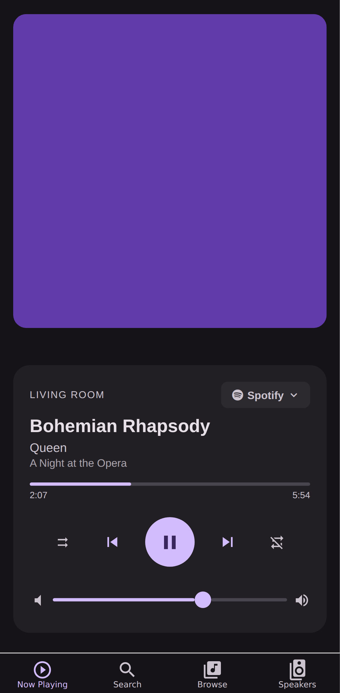
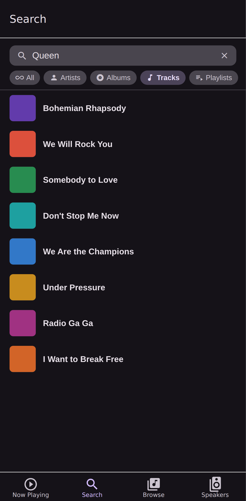
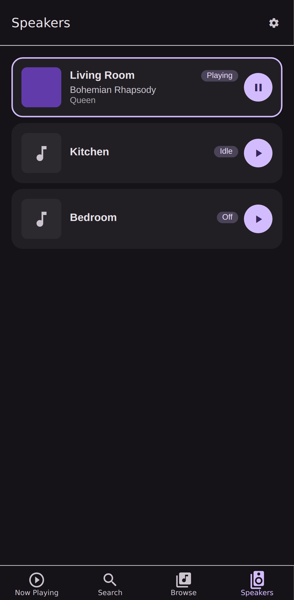

# Mediocre Media Controller

A native mobile app (React Native + Expo) that replicates and extends the multi-card UI from [mediocre-hass-media-player-cards](https://github.com/antontanderup/mediocre-hass-media-player-cards). Connects directly to a Home Assistant instance via WebSocket and provides an app-like experience with smooth transitions, native gestures, album art, and multi-room media management.

> this is an experiment. hence the vibing.

## Screenshots

| Now Playing | Search | Speakers |
|-------------|--------|----------|
|  |  |  |

## Features

- Connect to any Home Assistant instance via WebSocket
- Browse and control all `media_player` entities
- Album art with dynamic color theming
- Volume control, playback controls, shuffle & repeat
- Multi-room speaker grouping
- Media browser & search
- Queue management
- Customizable accent color

## Setup

1. Install the APK (see [Releases](../../releases)) or build from source
2. Open the app and go to **Settings**
3. Enter your Home Assistant host, port, and a [long-lived access token](https://www.home-assistant.io/docs/authentication/#your-account-profile)
4. Save — the app connects and shows your media players

## Building from Source

```bash
yarn install
yarn android   # or: yarn ios
```

## Tech Stack

- React Native 0.81 + Expo 54 (New Architecture)
- Expo Router v4 (file-based routing)
- TypeScript 5.9 (strict)
- TanStack Form + ArkType for settings validation
- home-assistant-js-websocket for the HA connection
